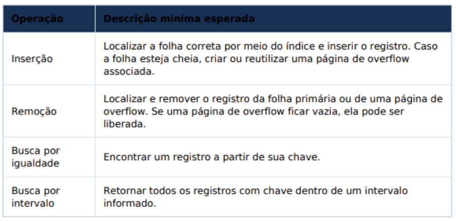

# Trabalho Prático de Implementação em Python
_Prazo de entrega 29/03/2026_  
### Grupo:  
- João Gustavo Irineu Braga  
- Isaac Mosiah Bandeira Maia de Maria 
- Victoria de Castro Moura

Este trabalho tem como objetivo implementar, em Python, uma simulação da estrutura de índice ISAM (Indexed Sequential Access Method), utilizada em sistemas de banco de dados para organizar e recuperar registros
com eficiência. 

O foco da atividade está na observação do comportamento da estrutura pormeio de inserções, remoções e buscas, com atenção especial ao surgimento e ao crescimento das páginas de overflow.

O material de apoio caracteriza o ISAM como uma estrutura estática: as páginas de índice permanecem fixas, enquanto as atualizaçõesafetam apenas as páginas folha e suas possíveis páginas de overflow. Essa característica deve orientar toda a modelagem do trabalho.
## 1. Objetivo
Implementar uma simulação funcional de um índice ISAM para registros, permitindo analisar como a estrutura se comporta diante de um conjunto fixo de operações de inserção, remoção e busca. Ao final, o grupo deverá ser capaz de explicar o percurso realizado nas
buscas e o impacto do overflow no custo das operações.
## 2. Escopo do Trabalho
Cada grupo deverá desenvolver uma estrutura ISAM simplificada para armazenar registros identificados por chaves inteiras.

A simulação deverá permitir:
- Inserção de registros;
- Remoção de registros;
- Busca por igualdade;
- Busca por intervalo.

Além da implementação, o grupo deverá analisar o comportamento da estrutura ao longo de várias operações, especialmente o crescimento das cadeias de overflow.
## 3. Estrutura inicial de índices
Para padronizar a atividade, todos os grupos deverão iniciar a simulação a partir de uma estrutura de índice já definida, com dois níveis de nós intermediários acima das páginas folha. As chaves abaixo devem ser adotadas como separadores iniciais do índice.

Interpretação esperada:

A raiz separa a busca em dois grandes ramos por meio da chave 40. No nível intermediário seguinte, os nós 20, 33 e 51, 63 refinam a navegação. No segundo nível intermediário, cada nó aponta para uma página folha primária específica, que inicialmente contém dois registros ordenados. A partir dessa configuração, novas inserções deverão ser direcionadas à folha correspondente; quando a folha estiver cheia, o grupo deverá utilizar páginas de overflow.
## 4. Operações Obrigatórias

## 5. Exemplo Prático de Entradas de Registros
Considere a configuração inicial apresentada na seção anterior e suponha a inserção dos seguintes registros adicionais: 23, 48, 41 e 42. A chave 23 deve ser direcionada à folha primária [20, 27]. Como essa folha já está ocupada, o registro deverá ser armazenado em uma página de overflow associada a ela. De forma análoga, as chaves 48, 41 e 42 pertencem à região da folha [40, 46]; como a folha também está cheia, esses novos registros passarão a compor uma cadeia de overflow dessa mesma folha. Esse processo ilustra a característica central do ISAM: a estrutura principal do índice permanece estática, enquanto as atualizações passam a ser absorvidas nas folhas e em páginas de overflow.
## 6. Requisitos de Modelagem
- As chaves devem ser inteiras.
- Cada grupo deve manter a estrutura inicial de índice definida neste enunciado.
- As páginas podem ser modeladas como listas ou objetos Python com capacidade
limitada.
- Não é necessário implementar persistência em arquivo ou acesso real a disco.
- Ponteiros podem ser representados por referências entre objetos.
## 7. Simulação Experimental
### Inserções Obrigatórias

| Ordem | Registro a Inserir |
| :--- | :--- |
| 1 | (18, R18) |
| 2 | (22, R22) |
| 3 | (27, R27) |
| 4 | (35, R35) |
| 5 | (41, R41) |
| 6 | (44, R44) |
| 7 | (63, R63) |
| 8 | (67, R67) |
| 9 | (83, R83) |
| 10 | (86, R86) |
| 11 | (121, R121) |
| 12 | (145, R145) |
### Remoções Obrigatórias

| Ordem | Chave a Remover |
| :--- | :--- |
| 1 | 27 |
| 2 | 44 |
| 3 | 67 |
| 4 | 83 |
| 5 | 145 |

### Buscas obrigatórias para medição de custo

| Tipo | Operação |
| :--- | :--- |
| Igualdade | buscar(22) |
| Igualdade | buscar(35) |
| Igualdade | buscar(44) |
| Igualdade | buscar(90) |
| Intervalo | buscar_intervalo(20, 50) |
| Intervalo | buscar_intervalo(60, 90) |
| Intervalo | buscar_intervalo(120, 150) |

Além de apresentar os resultados das operações acima, o grupo deve explicar, em linguagem clara, o caminho seguido em pelo menos uma busca por igualdade e uma busca por intervalo, indicando as páginas visitadas na ordem em que foram percorridas. O custo aproximado deverá ser expresso como número de nós percorridos.
## 8. Métricas a Serem Observadas
| Métrica | Objetivo da Observação |
| :--- | :--- |
| Quantidade de páginas folha | Avaliar a estrutura principal ocupada pelos registros primários |
| Quantidade de páginas de overflow | Medir o impacto das inserções após o preenchimento das folhas |
| Tamanho médio das cadeias de overflow | Avaliar a degradação potencial da busca |
| Quantidade de registros removidos | Obsevar a manutenção das páginas e a eventual liberação de overflow |
| Custo aproximado das buscas | Comparar o efeito do crescimento das cadeias de overflow |

## 9. Entregáveis

Cada grupo deverá entregar:
- Código-fonte em Python, organizado e comentado;
- relatório em PDF contendo descrição da modelagem, decisões de implementação, resultados experimentais e análise do comportamento da estrutura.

## Observações Finais
O foco principal do trabalho é a lógica da estrutura ISAM e a compreensão do papel desempenhado pelas páginas folha e pelas páginas de overflow. A modelagem pode ser simplificada, desde que preserve o comportamento esperado da estrutura de índice. Para quem fizer o trabalho a nota vai compor 10% da nota da NP1 (Em caso de a nota do trabalho não ser benéfica ela será descartada na NP1)